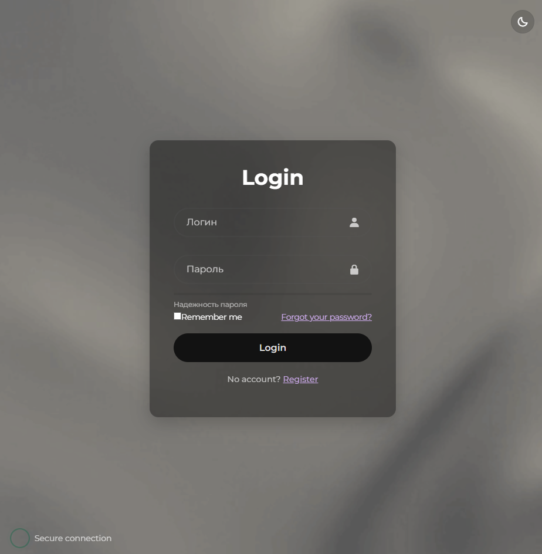

# Login Page — Аутентификация для сайта

современная форма входа с красивым дизайном, анимациями и переключением тёмной темы. идеально подойдёт как стартовая страница для веб-проекта.

 


---

## возможности

- стеклянный дизайн (glassmorphism)
- адаптивная верстка
- анимации при загрузке и наведении
- тёмная/светлая тема (с сохранением в localStorage)
- индикатор силы пароля
- кастомный tooltip с подсказкой к паролю
- иконки через [Boxicons](https://boxicons.com)

---

## технологии

- HTML5 + CSS3
- JavaScript (vanilla)
- Boxicons
- Google Fonts (`Montserrat`)

---

## запуск

скачайте проект или клонируйте:

```bash
git clone https://github.com/shak2o/login-page.git
